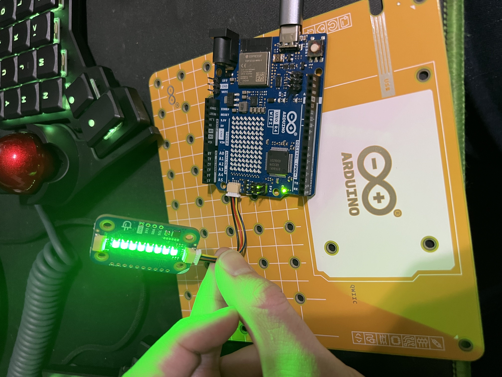

# Day One of Arduino

## Local Config Changes

Updated my .zshrc file and neovim config
* .zshrc: https://github.com/brian-nunez/shell-scripts/commit/d0efc3310797fee20c6aebb705366782161f55c8
* neovim: https://github.com/brian-nunez/brian-nunez.nvim/commit/30578c742cce416ba00875a4f9f9687e21986dbf


## Commands that I can use

Hopefully there is an easier way of doing this. For now, I'll just run these.

To build the sketch I used:
```bash
arduino-cli compile -b aduino:renesas_uno:unor4wifi .
```

For verbose logging use:
```bash
arduino-cli compile -b aduino:renesas_uno:unor4wifi .
```

To upload to the board use:
```bash
arduino-cli upload -p /dev/cu.usbmodem64E83369C8B82 -b ardunio:renesas_uno:unor4wifi
```


